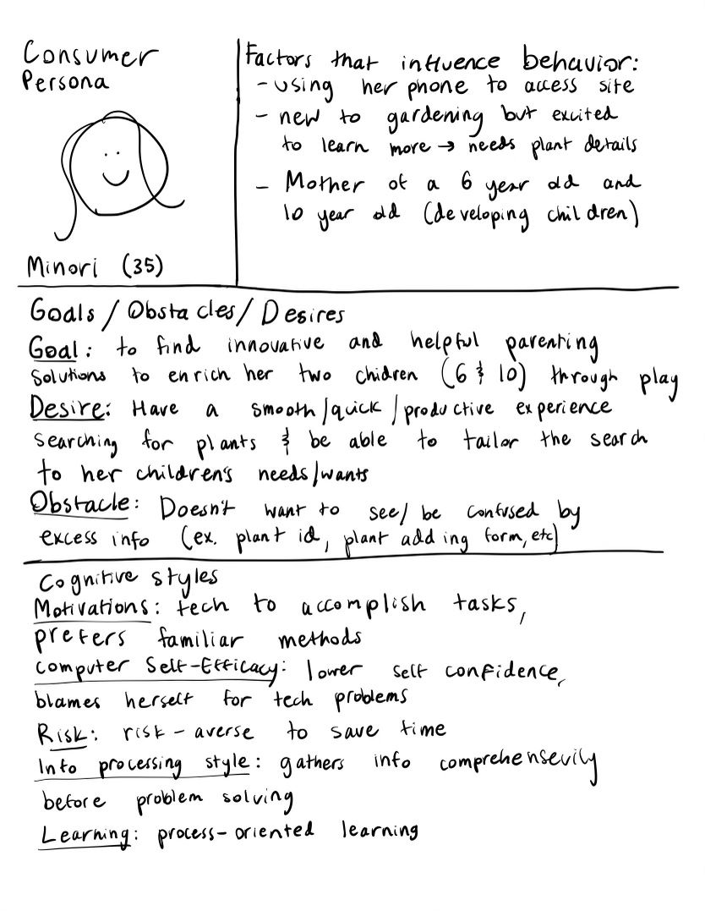

# Project 2: Design Journey

**For each milestone, complete only the sections that are labeled with that milestone.** Refine all sections before the final submission. If you later need to update your plan, **do not delete the original plan, leave it place and append your new plan below the original.** Explain why you are changing your plan. Remember you are graded on your design process. Updating the plan documents your process!

**Replace ALL _TODOs_ with your work.** (There should be no TODOs in the final submission.)

Be clear and concise in your writing. Bullets points are encouraged.

**Everything, including images, must be visible in Markdown Preview.** If it's not visible in Markdown Preview, then we won't grade it. We won't give you partial credit either. **Your design journey should be easy to read for the grader; in Markdown Preview the question _and_ answer should have a blank line between them.**


## Design / Plan (Milestone 1)

**Make the case for your decisions using concepts from class, as well as other design principles, theories, examples, and cases from outside of class (includes the design prerequisite for this course).**

You can use bullet points and lists, or full paragraphs, or a combo, whichever is appropriate. The writing should be solid draft quality.

### Audiences (Milestone 1)
> Who are your site's audiences?
> Briefly explain who the intended audiences are for your project website.
> **DO NOT INVENT RANDOM AUDIENCES HERE!** Use the audiences from the requirements.

_Consumer_: The consumers are the people who will be browsing/shopping from/learning from the Playful Plants project database. These people are generally assumed to be parents or caregivers of children of developing ages, since play with plants is most effective for children of developing ages.

_Site Administrator_: The administrators are the members of the Playful Plants project who are researchers at Cornell University. They will be using the site to log in as an administrator and add plants with their respective information to the database.


### _Consumer_ Audience Goals (Milestone 1)
> Document your audience's goals.
> List each goal below. There is no specific number of goals required for this, but you need enough to do the job.
> **DO NOT INVENT RANDOM GOALS HERE OR STEREOTYPE HERE!** Your goals are things that your users want accomplish when using the site (e.g. print a list of plants). These are informed by the Playful Plants objectives. Review the assignment's requirements for details.

_Consumer_ Goal 1: Learn about each plant's benefits and gardening details

- **Design Ideas and Choices** _How will you meet those goals in your design?_
  - I will make sure each plant in the database has its intended types of plays clearly listed out and any given details about how to garden/care for it explicitly mentioned.
- **Rationale & Additional Notes** _Justify your decisions; additional notes._
  - As a caregiver of a child, it is important to know exactly how something you're providing your child will help them, especially when you are putting the in the immense effort of planting a plant for them. Also, since a caregiver is not necessarily an experienced gardener, any information about how to care for this plant is super important to their experience with the project.

_Consumer_ Goal 2: See all plants in the database at once and have access to new plants as they come in

- **Design Ideas and Choices** _How will you meet those goals in your design?_
  - The page that contains the plants will be formatted in a way that the consumer can scroll through and see all of the plants, including ones that have been added recently by the administrator.
- **Rationale & Additional Notes** _Justify your decisions; additional notes._
  - The consumers are likely to care a lot about their children's wellbeing and for that reason would want to have full and updated access to the database to make sure they're choosing the right plants for them. If they are consistent users of the site, they also will likely be interested in reading about newly added plants they haven't seen yet.

_Consumer_ Goal 3: Be able to filter/sort the database and browse it by a certain tag

- **Design Ideas and Choices** _How will you meet those goals in your design?_
  - The consumer will have the option to filter the database using checkboxes and sort the database using a dropdown menu.
- **Rationale & Additional Notes** _Justify your decisions; additional notes._
  - Being able to search the database using certain methods makes it a lot more usable for consumers because it allows them to pinpoint the plants they want more effeciantly or find a specific one.

_Consumer_ Goal 4: Print the full or a filtered/sorted list of plants

- **Design Ideas and Choices** _How will you meet those goals in your design?_
  - I will make sure the CSS settings properly allow the consumer to print a well formatted list of plants from any given search.
- **Rationale & Additional Notes** _Justify your decisions; additional notes._
  - Many consumers may find it easier to have a list of plants in a concrete form on a piece of paper in front of them, especially if they are using the list as inspiration when they go to their local seed store. This list should be very readable and usable for the consumer.

_Consumer_ Goal 5: Be able to learn more about a plant with a detailed version of its entry

- **Design Ideas and Choices** _How will you meet those goals in your design?_
  - The consumer will have the option of clicking onto a plant and seeing more details about it.
- **Rationale & Additional Notes** _Justify your decisions; additional notes._
  - Without this feature, the consumer may be overwhelmed with unneccesary information about plants they are not interested in which would distract them from the things that are helpful to them.


### _Consumer_ Persona (Milestone 1)
> Use the goals you identified above to develop a persona of your site's audience.
> Create your persona using GenderMag's customizable personas.
> Take a screenshot and include it here. Persona must be visible in Markdown Preview; do not use PDF format!





### _Administrator_ Audience Goals (Milestone 1)
> Document your audience's goals.
> List each goal below. There is no specific number of goals required for this, but you need enough to do the job.
> **DO NOT INVENT RANDOM GOALS HERE OR STEREOTYPE HERE!** Your goals are things that your users want accomplish when using the site (e.g. print a list of plants). These are informed by the Playful Plants objectives. Review the assignment's requirements for details.

_Administrator_ Goal 1: Add a plant entry in the data base

- **Design Ideas and Choices** _How will you meet those goals in your design?_
  - Have an admin only form to add plants to the database with inputs for all of the information that will be displayed in the database.
- **Rationale & Additional Notes** _Justify your decisions; additional notes._
  - The administrators will need to add new plants to the database in order to keep it updated with new plants they are learning about.

_Administrator_ Goal 2: Delete a plant entry from the database

- **Design Ideas and Choices** _How will you meet those goals in your design?_
  - Have a button with the option to delete a specific plant entry for the admins.
- **Rationale & Additional Notes** _Justify your decisions; additional notes._
  - Certain plants may have to be removed due to better ones being added or due to them being out of season, etc.

_Administrator_ Goal 3: Edit a plant entry in the database

- **Design Ideas and Choices** _How will you meet those goals in your design?_
  - Each plant listing on the admin's end will have a button that allows you to edit the information initially inputted into that entry.
- **Rationale & Additional Notes** _Justify your decisions; additional notes._
  - New discoveries may arise that force the admins to update their entries in order to keep the database up to date.

_Administrator_ Goal 4: Log in to the site to have access to these tasks

- **Design Ideas and Choices** _How will you meet those goals in your design?_
  - Have an optional administrator log in form accessible for anyone who opens the site. Only those with an administrator username/password combination will be allowed into the site.
- **Rationale & Additional Notes** _Justify your decisions; additional notes._
  - The actions that admins are allowed to do cannot be done by anyone outside of the trusted Playful Plant project team because the website could be easily hijacked/hacked by anyone without the security of a log in. It is also important that even users with good intentions do not randomly add plants in order to keep the standard of the plants in the database high.


### _Administrator_ Persona (Milestone 1)
> Use the goals you identified above to develop a persona of your site's audience.
> Create your persona using GenderMag's customizable personas.
> Take a screenshot and include it here. Persona must be visible in Markdown Preview; do not use PDF format!


### Site Design (Milestone 1)
> Document your _entire_ design process. **We want to see iteration!**
> **Show us the evolution of your design from your first idea (sketch) to the final design you plan to implement (sketch).**
> **Show us how you decided what data to display to each audience.**
> **Plan your URLs for the site.**
> **Provide a brief explanation _underneath_ each design artifact (2-3 sentences).** Explain what the artifact is, how it meets the goals of your personas (**refer to your personas by name**).
>
> **Important!** Plan _all_ site requirements. Don't forget login and logout.

_Initial Designs / Design Iterations:_
_(Final design choices marked with green star)_


In this file I show the design ideas I went through for the consumer's view (on a mobile screen) of the database. I decided to include the images of each plant, its playtypes, and its gardening information (growing needs and characteristics). These are all essential pieces of information for Minori (consumer) to choose and learn about a plant. The playtypes, like in the last project, are important to having her choose the best fit for her child based on their needs/interests. The gardening information is important to she knows how to plant it, especially if she isn't experienced in gardening. The blurbs I included in project 2 (regarding visual interest, tactile, edible, and smell) are no longer necessary because the image shows most of these characteristics and the information would overwhelm Minori. Minori also does not need to see any form of id (plant id, tag id, etc) since those numbers will have no meaning to her.

I started with two tile formats for entries, one with two columns and one with the entries stacked. I thought the stacked one was more familiar for smartphone users because of the commonness of scrolling the internet/texts/social media. Then I made another version of it that was more condensed in order to allow Minori to see as many plants at once as possible since she likes to see all options before deciding. This would also save time for her since she's busy. I also chose a more basic detailed view style for an individual plant because the pop up option would confuse Minori due to its unfamiliarity.


Here is my filtering/sorting form (I sketched it seperately to the database so I could draw it bigger). I chose to use checkboxes for the playtypes and dropdown menu for the sorting options, with the search button on the right bottom to go with Minori's eyeline.


Then I sketched the adminstrator view (on a laptop screen). Their database is different because it doesn't include the image files (I assume the admins have the images already in a folder on their computer and can refer to them from the given ids, loading the images would just take up time and space on the screen). Also contrary to Minori's screen, Skye's (administrator) screen will have all tags listed and she will be able to filter by tag. Admins will likely need to make sure the tags are up to date especially when items are being deleted/edited all the time. I chose the tile-style database as oppose to the grey and white one on the left because the large amount of information would be crammed into one row in the first option. The layout of the second option would also support Skye's eyeline more by putting most important information on the top of the tile. My add plant form is similiar to my last one except it has an input to upload a file for the plant.


Here I seperately sketched out the edit/delete features of the site. I decided having links with straightforward words on them would be better than icons to support Skye's wish to have self explanatory technology and also better than buttons to support avoiding an excess of "submit" buttons regarding catalog design ideals.


I added this sketch in milestone 3 to plan the edit page for each entry. It will have a form where the admins can update anything they want and then a button that clearly states "update", which brings you back to the database to continue browsing. Skye will know exactly how to use the page since she is familiar with forms and it will automatically save her update and return her to the database with one click. The main page will also notify her that the listing was updated to assure her that her action worked.

_URLS:_
| Route | PHP File                            |
| ----- | ----------------------------------- |
| /        | pages/index.php      |
| /plants  | pages/plants.php    |
| /log-in  | pages/login.php    |

### Design Pattern Explanation/Reflection (Milestone 1)
> Write a one paragraph (6-8 sentences) reflection explaining how you used design patterns for media catalogs in your site's final design.

For the consumer view of the site, I tried out both popular layouts for a catalog: grid and tiled. Both of these are very popular in media catalogs but I went with the tiled one for the sake of Minori's cognitive styles. The detailed page when you click on an entry is also a common feature of a media catalog. Mine brings Minori to a new page with an enlarged photo and added information if she wishes to learn more. I also noticed that many interactive media catalogs (like drives/photo albums) have icons to delete/share/edit photos which I liked, but I used words instead because of Minori's cognitive styles. I tried to follow the idea of having the most important information about an entry be displayed before clicking on it, and then the rest of the information coming up after clicking. Another trend I noticed in these catalogs is that the image is always on the left hand side if it is a tile-style, which is probably because it is helpful for the user's eyeline. I followed this as well. Lastly, the sorting/filtering form is usually either on top above the entries or on the left hand side. I noticed that the form being on the left hand side is more common when there are a lot of things to filter/sort by, which there aren't in this site so I could fit it right above without being distracting.

_Added in final submission:_
Upon getting the feedback that my admin page could be more data-centric in it's design, I decided to

### Cognitive Styles Explanation/Reflection (Milestone 1)
> Write a one paragraph (6-8 sentences) reflection explaining how your final design supports the cognitive styles of each persona.

_Consumer Cognitive Styles Reflection:_

Minori is able to scroll through the entries in a way that is familiar to her from other mobile internet experiences. In this way she doesn't have to learn new technology. When she clicks on an entry it takes her to a straightforward page with just the information about the plant. The tiles are condensed on the main page in order to save her time in her busy schedule.


_Site Administrator Cognitive Styles Reflection:_

Skye will have an obvious place to log into the admin part of the site, in the nav bar. She won't have much learning to do (no tinkering required) because each part of the site (filtering/sorting the database, browsing the database, adding a plant) is very explicitly labeled. When editing/deleting an entry, Skye will see clearly labeled EDIT and DELETE links rather than unfamiliar icons. The feedback she recieves on the log in and add a plant forms will be encouraging and specific, so that she doesn't need to guess where she went wrong.


## Implementation Plan (Milestone 1, Milestone 2, Milestone 3, Final Submission)

### Database Schema (Milestone 1)
> Describe the structure of your database. You may use words or a picture. A bulleted list is probably the simplest way to do this. Make sure you include constraints for each field.
> **Hint: You probably need a table for "entries", `tags`, `"entry"_tags`** (stores relationship between entries and tags), and a `users` tables.
> **Hint: For foreign keys, use the singular name of the table + _id.** For example: `image_id` and `tag_id` for the `image_tags` (tags for each image) table.

Table: plants

- id: INT {NN, PK, U, AI}
- tag_id: INT {NN, PK, U}
- image_id: INT {NN, PK, U}
- plant_name: TEXT {NN}
- species_name: TEXT {NN}
- is_exploratoryconstructive: INT {NN}
- is_exploratorysensory: INT {NN}
- is_physical: INT {NN}
- is_imaginative: INT {NN}
- is_restorative: INT {NN}
- is_expressive: INT {NN}
- is_withrules: INT {NN}
- is_bioplay: INT {NN}

Table: tags

- id: INT {NN, PK, U, AI}
- plant_id: INT {NN, PK, U}
- is_perennial: INT {NN}
- is_annual: INT {NN}
- is_fullsun: INT {NN}
- is_partialshade: INT {NN}
- is_fullshade: INT {NN}
- is_shrub: INT {NN}
- is_grass: INT {NN}
- is_vine: INT {NN}
- is_tree: INT {NN}
- is_flower: INT {NN}
- is_groundcovers: INT {NN}
- is_other: INT {NN}

Table: images

- id: INT {NN, PK, U, AI}
- plant_id: INT {NN, PK, U}
- file_name: TEXT {NN}

Table: users

- id: INT {NN, PK, U, AI}
- username: TEXT {NN, U}
- password: TEXT {NN, U, PK}

_Added in milestone 2 to follow feedback:_

I realized that I had unneccesarily fields to some of the tables. Instead, I deleted these repetitive fields and replaced them with a "relationships" table that can connect plants to multiple tags (before it would only give a plant one tag). I also realized since each plant only has one image, there is no reason to have a seperate table for images so I got rid of that and added the file_name field to the plants table. In addition, I realized that playtypes can be a type of tag. When I went to add all the playtypes to the tags table, I realized that there is no reason for there to be a table with so many columns with boolean values. Instead, it could just have a tag column with all of the playtypes and other tags in it.

The new schema I came up with to implement is below:

Table: relationships

- id: INT {NN, PK, U, AI}
- tag_id: INT {NN, PK, U}
- plant_id: INT {NN, PK, U}

Table: plants

- id: INT {NN, PK, U, AI}
- file_name: TEXT {NN}
- plant_name: TEXT {NN}
- species_name: TEXT {NN}

Table: tags

- id: INT {NN, PK, U, AI}
- tag: TEXT {NN, U}

Table: users

- id: INT {NN, PK, U, AI}
- username: TEXT {NN, U}
- password: TEXT {NN, U, PK}

_Added in final submission to implement login logout:_

Table: sessions

- id: INT {NN, PK, U, AI}
- user_id: INT {NN}
- session: TEXT {NN, U}
- last_login: TEXT {NN}

Table: memberships

- id: INT {NN, PK, U, AI}
- group_id: INT {NN}
- user_id: INT {NN}

Table: groups

- id: INT {NN, PK, U, AI}

### Database Query Plan (Milestone 1, Milestone 2, Milestone 3, Final Submission)
> Plan _all_ of your database queries. You may use natural language, pseudocode, or SQL.

```
Log in query:
SELECT * FROM users WHERE (username == [variable for inputted username] && password == [variable for inputted password])
```

```
Delete entry query:
DELETE * FROM plants WHERE (plant_id == [variable for id on clicked on entry])
```

```
Edit entry query:
UPDATE plants SET
  [variable for chosen to update] = [variable for value];
  WHERE (plant_id == [variable for id for entry chosen to edit])
```

```
Add query:
INSERT INTO plants (plant_name, species_name, file_name) VALUES [variables for the form inputs for these fields];
```

```
Sort query:
Done in project 2
```

```
Join query:
SELECT * FROM relationships
  INNER JOIN plants on
  (relationships.plant_id = plants.id) INNER JOIN
  tags on (relationships.tag_id = tags.id);

Note in milestone 3: I thought I would use this query in the beginning to display the data, but then I realized I actually used this for filtering to filter by the tag_id in my tags table.

Note in final submission: Upon looking at this query's result in sqlite I realized that it wasn't giving me a helpful database. I plan to use this query instead for filtering and only sometimes for displaying information:

SELECT
	plants.plant_name AS 'plant_name',
	plants.species_name AS 'species_name',
	plants.file_name AS 'file_name',
	relationships.plant_id AS 'plant_id',
	tags.tag AS 'tags.tag'
FROM
	relationships
	INNER JOIN plants ON (plants.id = relationships.plant_id)
	INNER JOIN tags ON (tags.id = relationships.tag_id)
```

```
Delete query:
DELETE FROM plants WHERE id = [variable from hidden input to get id];
```

```
Edit query:
UPDATE plants SET ([variable of field] = [variable of new field content] WHERE id = [variable from hidden input to get id]);
```

```
Tag query:
UPDATE plants SET ([variable of tag] = [variable of new tag setting - whether it has it or not] WHERE id = [variable from hidden input to get id]);
```

### Code Planning (Milestone 1, Milestone 2, Milestone 3, Final Submission)
> Plan any PHP code you'll need here using pseudocode.
> Tip: Break this up by pages. It makes it easier to plan.

```
Log in PHP:
if form submitted
  if SQL query for username and password is in the users table
    show html code for admin side of plants.php
    show "log out" instead of "log in"
  else
    show feedback class
```

```
Delete PHP:
if link to delete clicked
  store plant_id in PHP variable
  execute SQL delete query
```

```
Edit PHP:
if link to edit clicked
  store plant_id in PHP variable
  store updated values in PHP variables
  execute SQL edit query with those values
```

```
Sticky forms PHP:
if form submitted
  store form entries in variables
  set default values of inputs to last entry
```

```
Display detail/all PHP:
create empty array
for each entry in relationships where id = id of plant being displayed
  add add id to the array
```

### Accessibility Audit (Final Submission)
> Tell us what issues you discovered during your accessibility audit.
> What do you do to improve the accessibility of your site?

TODO


## Reflection (Final Submission)

### Audience (Final Submission)
> Tell us how your final site meets the goals of your audiences. Be specific here. Tell us how you tailored your design, content, etc. to make your website usable for your personas.

TODO


### Additional Design Justifications (Final Submission)
> If you feel like you haven’t fully explained your design choices in the final submission, or you want to explain some functions in your site (e.g., if you feel like you make a special design choice which might not meet the final requirement), you can use the additional design justifications to justify your design choices. Remember, this is place for you to justify your design choices which you haven’t covered in the design journey. You don’t need to fill out this section if you think all design choices have been well explained in the design journey.

TODO


### Self-Reflection (Final Submission)
> Reflect on what you learned during this assignment. How have you improved from Project 2? What would you do differently next time?

TODO


> Take some time here to reflect on how much you've learned since you started this class. It's often easy to ignore our own progress. Take a moment and think about your accomplishments in this class. Hopefully you'll recognize that you've accomplished a lot and that you should be very proud of those accomplishments!

TODO


### Grading: Step-by-Step Instructions (Final Submission)
> Write step-by-step instructions for the graders.
> The project if very hard to grade if we don't understand how your site works.
> For example, you must login before you can delete.
> For each set of instructions, assume the grader is starting from /

_View all entries:_

1. You will start off on a brief about page
2. Use the nav bar to hit "plants", which will be the consumer/guest view of the database
3. If you are an admin, navigate to the log in page from the nav bar log in with the username "kyle" and the password "monkey"
4. Once logged in, you can click back to the "plants" page and automatically be in the admin view

_View all entries for a tag:_

1. Either start off without logging in our log out to be in the consumer view
2. Use the radio buttons on the filtering form on top of the database and hit "search" to filter the entries by a certain tag

_View a single entry's details:_

1. On either the consumer or admin page, hit the "details" button by every listing
2. Once you are done, hit the "back to plants" button or use the nav bar to get to another page

_How to insert and upload a new entry:_

1. In the admin view, scroll to the bottom of the page
2. Use the add plant form to insert the information about the plant and hit "submit"
3. You will see confirmation at the top that your plant has been submitted

_How to delete an entry:_

1. In the admin view, hit the "delete" button by every listing
2. You will see confirmation at the top that the entry has been deleted

_How to edit and existing entry and its tags:_

1. In the admin view, hit the "edit" button by every listing
2. In the edit page, edit any text or checkbox fields you may want
3. Once you hit "update", you will be automatically redirected to the database where the entry will be updated
